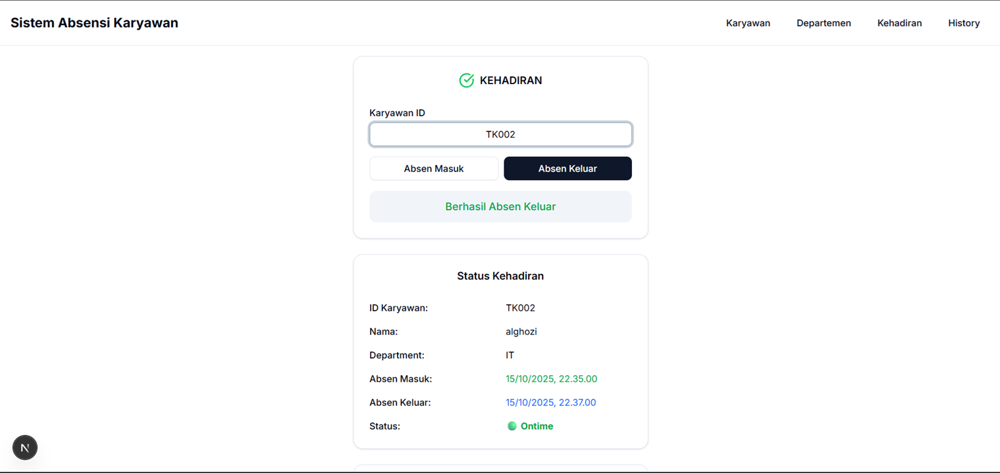

# 🧾 Employee Attendance System

Sistem Absensi Karyawan berbasis web yang dibangun menggunakan **Golang (Gin + GORM)** untuk backend dan **Next.js (TypeScript + Shadcn/UI)** untuk frontend.  
Aplikasi ini dirancang untuk memudahkan proses pencatatan kehadiran karyawan secara **real-time**, mulai dari absensi masuk, absensi keluar, hingga rekap data kehadiran per departemen.

---

## 🧠 Deskripsi Singkat

Sistem ini memungkinkan admin dan karyawan untuk:

- Melakukan **absen masuk & keluar** secara online.  
- Melihat **status kehadiran** (ontime, sedang bekerja, selesai bekerja).  
- Mengelola **data karyawan dan departemen (CRUD)**.  
- Memantau **rekapitulasi kehadiran** berdasarkan tanggal dan departemen.  

Proyek ini dibuat sebagai **portofolio pribadi**, berfokus pada penerapan konsep **CRUD**, **relasi antar tabel**, serta **integrasi antara backend (API Golang)** dan **frontend (Next.js)**.

---

## 🧰 Teknologi yang Digunakan

### 🖥️ Backend
- **Golang** – Bahasa pemrograman utama  
- **Gin** – Framework web untuk RESTful API  
- **GORM** – ORM untuk koneksi database  
- **MySQL** – Database relasional utama  

### 💻 Frontend
- **Next.js 14** – Framework React modern untuk server-side rendering  
- **Shadcn/UI** – Komponen UI berbasis Tailwind CSS dengan tampilan modern dan responsif  
- **Axios** – Untuk komunikasi antara frontend dan backend  

---

## ⚙️ Instalasi

### 1️⃣ Jalankan Backend (Golang)
```bash
go mod download
go run main.go

Jalankan Frontend (Next.js)
npm install
npm run dev

Konfigurasi Environment (.env)
DB_HOST=localhost
DB_PORT=3306
DB_NAME=absensi_db
DB_USER=root
DB_PASSWORD=your_password

API Documentation

Kamu dapat mengakses dokumentasi lengkap API di Postman:
https://documenter.getpostman.com/view/31826789/2sB3HqJz1B

